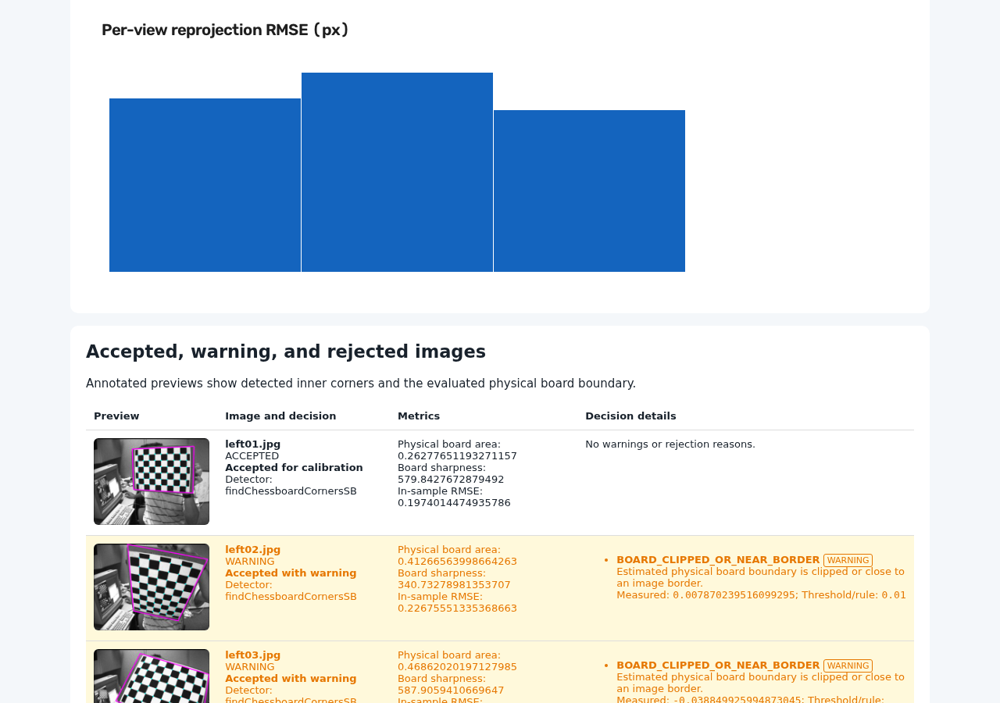

# Validate Camera Calibration Images Before cv2.calibrateCamera

OpenCV Calibration Audit checks checkerboard camera-calibration datasets for
blur, exposure problems, duplicate poses, weak image-plane coverage, limited
pose diversity, and high reprojection error. It produces an explainable HTML
report before unsuitable images reach a production calibration pipeline.

Use it when a complete checkerboard detection and a low aggregate OpenCV RMS
are not enough evidence that your image set is varied, sharp, and useful.
Analysis runs locally and does not modify source images.

## Run your first audit in 30 seconds

Install the command-line tool:

```bash
python -m pip install opencv-calibration-audit
```

Analyze a folder of images:

```bash
calibration-audit analyze ./calibration_images \
  --cols 9 \
  --rows 6 \
  --square-size 30 \
  --unit mm \
  --output ./audit_result
```

`--cols` and `--rows` are inner-corner counts. A checkerboard with 10 × 7
squares has 9 × 6 inner corners.

```text
Quality gates: PASSED
Accepted views: 12
OpenCV RMS: 0.284931 px
Report: audit_result/report.html
```

[Follow the getting-started tutorial](getting-started.md) or read the
[dataset-validation guide](guide/validate-opencv-camera-calibration-dataset.md).

## See the evidence

The HTML report records the decision stage, measured value, threshold, and
stable reason code for every image.



[Open the self-contained smoke report](example-report/report.html) ·
[Inspect its JSON data](example-report/summary.json)

!!! warning "A smoke example, not a production benchmark"
    The published report uses three redistributable real-camera images. It
    proves the end-to-end path but does not represent a production-ready
    calibration dataset. Its field-coverage ratio is only `0.0833`.

## Quality signals

- **Detection and readability:** supported files, decode failures, complete
  inner-corner detections, and resolution consistency.
- **Image quality:** global and board-region sharpness plus exposure warnings.
- **Coverage:** board-center occupancy and corner-observation density across
  the image plane.
- **Pose diversity:** scale bins, circular rotation range, and signed
  horizontal and vertical perspective ranges.
- **Duplicate views:** normalized center, board area, wrapped rotation, and
  perspective distance.
- **Calibration residuals:** OpenCV RMS and per-view reprojection statistics.

These measurements are diagnostic evidence, not a calibration certificate.
Thresholds are heuristics that must be checked against the camera, image
resolution, target, and downstream accuracy requirements.

## Outputs for people and automation

Each run can produce:

- `report.html` for an offline, human-readable review;
- `summary.json` for complete typed results and CI policies;
- `images.csv` for per-image analysis;
- `calibration.yaml` for pinhole calibration parameters;
- `accepted.txt` and `rejected.txt` for downstream file selection.

See the [output schema](reference/output-schema.md) and
[decision-code reference](reference/decision-codes.md).

## Scope

Version 0.2.2 supports standard black-and-white checkerboards, monocular
calibration, and OpenCV's pinhole camera model on Python 3.10–3.13. It does not
support stereo or fisheye calibration, ChArUco/ArUco, circle grids, live
capture, automatic pruning, or ROS camera-info output.

[Read all limitations](about/limitations.md).

## Project links

- [Install from PyPI](https://pypi.org/project/opencv-calibration-audit/)
- [View source and report issues on GitHub](https://github.com/flavvesResearch/opencv-calibration-audit)
- [Read the changelog](https://github.com/flavvesResearch/opencv-calibration-audit/blob/main/CHANGELOG.md)
- [Maintainer and site operations](about/maintainer.md)

_Documentation version: 0.2.2 · Updated: 2026-07-31_

<script type="application/ld+json">
{
  "@context": "https://schema.org",
  "@type": "SoftwareApplication",
  "name": "OpenCV Calibration Audit",
  "description": "Validate OpenCV checkerboard camera-calibration datasets for blur, duplicates, coverage, pose diversity, and reprojection error.",
  "applicationCategory": "DeveloperApplication",
  "operatingSystem": "Linux, macOS, Windows",
  "softwareVersion": "0.2.2",
  "downloadUrl": "https://pypi.org/project/opencv-calibration-audit/",
  "license": "https://opensource.org/license/mit",
  "offers": {
    "@type": "Offer",
    "price": "0",
    "priceCurrency": "USD"
  }
}
</script>
